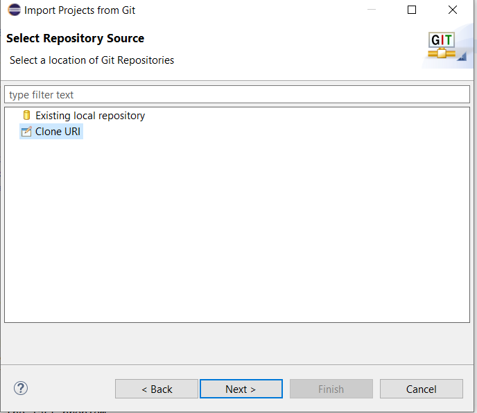

[](https://generalassemb.ly/education/web-development-immersive)
<small style="color: gray">This was work from <span title="General Assembly">GA</span></small>

# homework-week4-day1-Java
## Instructions
1. Fork this repository.
2. In ```Eclipse``` : **File -> Import -> Git -> Projects From Git -> URI** as below : 




3. Open the project in ```Eclipse```

3. Create a file called Main.java and add all answers to it. 

---
1- Change this source code, so that it gets
compiled successfully?

```java

class Main {
 public static void main(String [] args)
    System.out.println("What is wrong with me?)
   }
  }

```
---

 2-  Write a Java program that performs the following steps.
 1. Declare two int variables named x and y.
 2. Assign 3 to x.
 3. Assign twice the value of x to y.
 4. Interchange the value of x and y (without explicitly
assign 3 to y).
 5. Print the values of both variables on screen

. Show a single Java statement that can perform both tasks in step
2 and 3 in the last problem.


---
3- Determine the resulting value of the variable x in the following
code segment.
```java
double x;
int y = 90;
x = y/100;
System.out.println("x="+x);
```


---
4- An integer n is prime if its only factors are 1 and itself. Write a java method for checking whether the value of an int n is
prime. 


---
5- Use nested loops to write a Java program that generates a
multiplication table as shown below.
```
  | 2  3  4  5  6  7  8  9
  |
2 | 4  6  8  10 12 14 16 18
3 | 6  9  12 15 18 21 24 27
4 | 8  12 16 20 24 28 32 36
5 | 10 15 20 25 30 35 40 45
6 | 12 18 24 30 36 42 48 54
7 | 14 21 28 35 42 49 56 63
8 | 16 24 32 40 48 56 64 72
9 | 18 27 36 45 54 63 72 81
```
---
## Optional Exercise :
6- Write a method that replaces any number of multiple
spaces connected together in a String reference s with single
spaces.
For example, if s contains:
<pre>"This does    not contain  multiple    spaces"</pre>
it should be changed to:
<pre>"This does not contain multiple spaces"</pre>

---
## How to commit :
In ```Eclipse``` : **Right click on your project -> Team -> Commit -> Follow Instructions** as below : 


### Move changes to staged then commit and push :


### Create a Pull Request.
